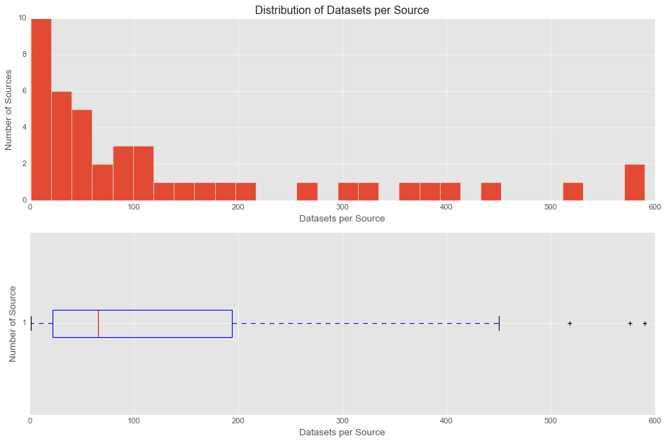
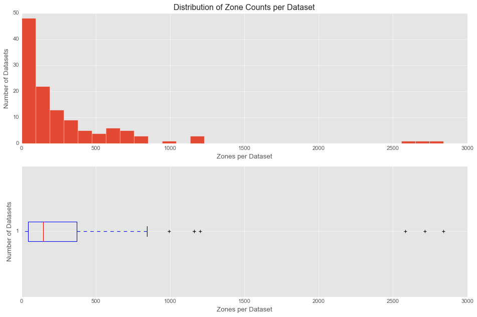
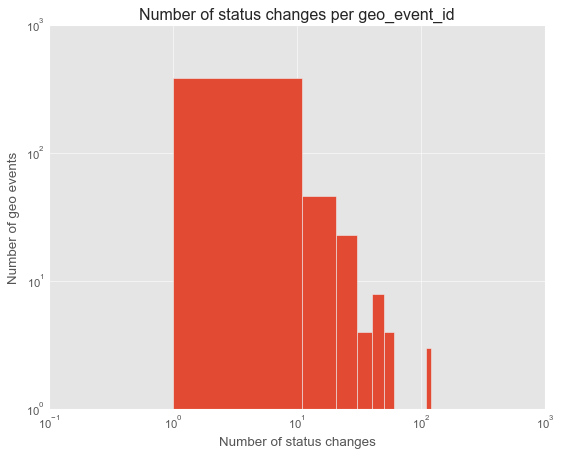
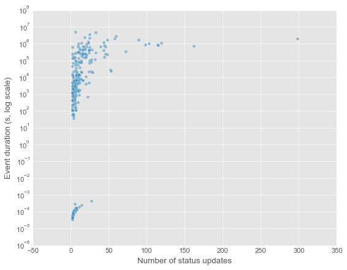

title: WiDS Datathon 2026 Presentation - BEACON

# WiDS AI Forum 2026
## BEACON: Broadscale Evacuation Agentic Coordination, Outreach & Navigation
### Equitable Wildfire Collective — Shruti Kulkarni, Helen Lin, Aditi Nambooripad, Chelyah Miller, Lynn Tong

---

# Problem Statement

* Wildfires kill roughly 40,000 Americans every year, and fire seasons are now 84 days longer than in the 1970s
* 26 million U.S. residents have limited English proficiency, yet 80% of emergency alerts are English-only
* Multilingual alerts won't be federally required until 2028
* Existing tools don't support residents whose primary language isn't English
* **Target user:** Non-English speaking residents in wildfire-prone areas

---

# Data Overview

* **WatchDuty** - Real-time fire polygons with perimeter boundaries and timestamps, used for danger assessment and routing
* **HRRR (NOAA)** - Hourly weather model at 3 km resolution (wind speed, direction, humidity), used to compute the Hourly Wildfire Potential (HWP) score
* **User GPS** - Live coordinates captured at session start to calculate distance to the nearest fire perimeter
* **Shelter & Facility Lists** - Evacuation centers and staging sites from the OverPass API (static, no live availability)
* All data is stored and queried via Google BigQuery

---

# Data Cleaning & Preprocessing

* HWP is computed from raw HRRR fields using the formula:
  `HWP = 0.213 × G^1.50 × VPD^0.73 × (1 − M)^5.10 × S`
  (G = wind gust, VPD = vapor pressure deficit, M = soil moisture, S = snow suppression)
* A 9×9 spatial smoothing filter (~27 km) is applied to the HWP grid
* Coastal NaN values are normalised with a weight array to avoid bleed into valid land points
* Evacuation zones are filtered to within 50 km of the user using BigQuery's `ST_DISTANCE`
* Only zones with a status of advisory, warning, or order are included
* A `ROW_NUMBER()` window function keeps the most recently modified record per zone
* HWP extraction is scoped to Colorado (lat 37–41°N, lon −109.1–−102°W)

---

# Exploratory Data Analysis

**Geo Events (WatchDuty)**
* 62,696 total events (2021–2025); 61,779 wildfires + 917 location events; 227 active at query time
* Fire acreage is highly skewed, median 145 acres vs mean 6,155 acres (max 145,504 acres)
* Most events are short-lived with few status changes; a small number of fires drive the majority of updates (max 298 status changes per event)
* 42,231 events have changelogs; 20,465 do not, gaps in update history are common

**Fire Perimeters**
* 6,207 records; 4,139 approved; date range January–September 2025
* Visibility × historicity breakdown: 2,746 not visible/not historical, 1,243 visible/historical, 100 visible/not historical, 50 not visible/historical

**Evacuation Zones**
* 37,458 total records; ~90% active (33,554); sourced from Genasys Protect (83%) and a long tail of local agencies
* Dataset size distribution is heavily right-skewed, most datasets have 0–500 zones; a few exceed 2,500
* The dominant change type in the changelog is `external_status` (33,524 changes), confirming status churn is the main signal
* Inconsistent status labels across sources (e.g., "Normal", "No Order or Warning", "Lifted", "INACTIVE") required normalization

---

# Modeling Approach

**Conversational Agent**
* **Claude Sonnet 4.6** detects the user's language, adjusts tone based on danger level, generates personalised evacuation checklists, and translates turn-by-turn directions when needed

**Fire Danger Scoring**
* The **HWP physics model** (NOAA HRRR) measures how favorable weather conditions are for fire spread using wind, humidity, soil moisture, and snow cover
* Routes are rejected if more than 10% pass through high-HWP zones

**HWP Refresh Scheduling (models tried)**
* The goal was to predict max HWP over the next 12 hours and classify it into four tiers: Safe, Elevated, High, Extreme
* **Random Forest Regressor** - baseline approach
* **HistGradientBoosting Regressor** - regression with log-transform, MAE: 16.69
* **HistGradientBoosting Classifier** with balanced sample weights - 4-tier classification, selected for deployment
* Features used: hour of day, month, current HWP, lags at 1h/3h/12h/24h, 3h and 12h momentum, 24h rolling mean
* Train/test split: 80/20 chronological (July–Aug 2025 train, September 2025 test)
* Deployed as a **BigQuery Boosted Tree Classifier** (`hwp_refresh_model`) with auto class weights

**Routing**
* **OpenRouteService (ORS)** was chosen over Google Maps because Google Maps repeatedly ignored fire polygon constraints

**Memory**
* **mem0 + Qdrant** provides cross-session semantic memory using OpenAI embeddings, so the agent remembers user context across conversations

---

# Model Evaluation

Because we only had time series data, the model wasn't highly accurate across all four tiers. However, it performed well at the most important task: distinguishing **Safe vs. non-Safe** HWP conditions over the next 12 hours. That binary signal was enough to meaningfully reduce compute — non-safe zones refresh every hour, safe zones refresh every 3 hours.

**BigQuery ML.EVALUATE results (production model):**

| Metric    | Value |
|-----------|-------|
| Precision | 0.55  |
| Recall    | 0.57  |
| Accuracy  | 0.55  |
| F1 Score  | 0.55  |
| Log Loss  | 0.97  |
| ROC AUC   | 0.82  |

The ROC AUC of 0.82 shows the model is genuinely able to separate classes, even if overall accuracy is modest.

**BigQuery Confusion Matrix:**

| Expected \ Predicted | Elevated  | Extreme   | High      | Safe      |
|----------------------|-----------|-----------|-----------|-----------|
| Elevated             | 1,558,340 | 134,960   | 528,353   | 933,414   |
| Extreme              | 235,314   | 1,040,721 | 400,083   | 33,428    |
| High                 | 1,370,616 | 808,301   | 1,744,941 | 357,034   |
| Safe                 | 624,580   | 98,184    | 143,415   | 2,667,510 |

* The Safe class is predicted most reliably — very few Safe instances are misclassified as Extreme (98k out of ~3.5M)
* Extreme is also well-separated from Safe, which is the critical safety boundary
* Elevated and High are frequently confused with each other, which is acceptable since both trigger the 1-hour refresh cadence

---

# Visualizing Results

**EDA Maps & Charts**
* Folium maps overlaying fire perimeters (historical vs. current) and evacuation zones (active vs. inactive) on live basemaps
* Bar charts of evacuation zone source attribution - Genasys Protect dominates at 83%
* Histogram of dataset sizes shows a long tail; most datasets are small, a few are very large outliers

**Geo Event Patterns**
* Scatter plot (log scale) of status-update count vs. event duration reveals a cluster of high-churn, long-duration fires
* Histogram of status changes per event confirms most fires are quiet; a heavy tail of high-activity events drives the bulk of data volume

**HWP Model Performance**
* Confusion matrix (see Model Evaluation slide) shows Safe and Extreme classes are well-separated, the safety-critical boundary the model needs to get right
* ROC AUC of 0.82 confirms the model genuinely discriminates between classes despite modest overall accuracy
* Elevated and High tiers are frequently confused, but both map to the same 1-hour refresh cadence so the practical impact is low

---

# Key Insights

**Three pivots shaped the project:**

* **Data source** — Started with NASA FIRMS satellite hotspots, but WatchDuty's real-time fire perimeter data proved far more actionable for routing
* **Architecture** — The original plan was a dashboard pushing alerts, but real-time fire data needed a dynamic conversational layer to be useful
* **Target user** — Initially focused on rural and elderly populations, but non-English speakers turned out to be the largest underserved group

**One important distinction:** HWP is not a fire tracker. It measures weather conditions favorable to fire spread and is used to filter routes, not locate fires.

---

# Future Work

* Integrate live government data feeds so shelter availability reflects official announcements rather than a static list
* Move HRRR from fixed polling to a pattern-based refresh cadence that scales with fire activity
* Add human review for safety-critical translations
* Add speech-to-text input for users who can't type during an emergency
* Build an Android version (current app is iOS only)
* Improve accessibility for blind users with audio-first navigation
* Tighten prompts for more consistent agent responses and stronger SOS guardrails

---

# Summary & Reflections

**What worked well:**
* Language detection anchored to the most recent message, so users can switch languages mid-conversation
* ORS polygon-avoidant routing reliably kept routes clear of active fire perimeters
* Full context (location, danger level, safe route) is injected before the first message, so every conversation starts immediately useful
* Graceful degradation at every failure point kept the system functional even when individual components went down

**Architecture:** Dockerized FastAPI backend with three memory layers — Postgres for structured user data, Firestore for conversation history (with Claude-powered summarisation), and Qdrant for semantic vector memory.

**Key lesson:** In an emergency, a less-optimal response is always better than no response.

---

# Thank You!

Questions? Reach the Equitable Wildfire Collective:
Shruti Kulkarni · Helen Lin · Aditi Nambooripad · Chelyah Miller · Lynn Tong
